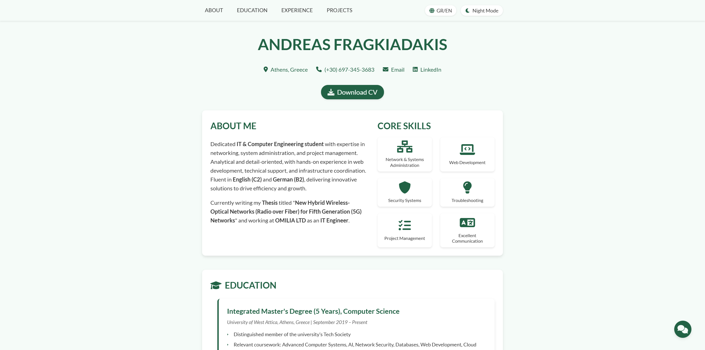

# Andreas Fragkiadakis - CV Website
Hello!
This repository hosts my personal CV website, showcasing my skills, education, and experience in IT and Computer Engineering.

## Live Site
Visit it at <a href="https://andrewfragkiadakis.github.io" target="_blank" rel="noopener noreferrer">https://andrewfragkiadakis.github.io</a> <i class="fas fa-external-link-alt"></i>

## Features
- Downloadable PDF version of my CV (English and Greek)
- Light and dark theme toggle with dynamic coloring theme
- Bilingual support (English/Greek) with smooth language switching
- Mobile-friendly webpage
- Animated skill progress bars

## Screenshot

## About Me
I’m an IT & Computer Engineering student with expertise in networking, system administration, and web development. 
This site is a creative representation of my professional journey, now available in both English and Greek.

---
Built with ❤️ using HTML, CSS, and JavaScript.
